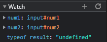

# Devtools Part 2

1. The bug was that num1 and num2 were strings when being processed inside of calculateSum, so the addition of result would actually be concatenation instead of addition.

2. I would fix this by using the Number() function to change num1 and num2 to be the number version of themselves before result is computed.

